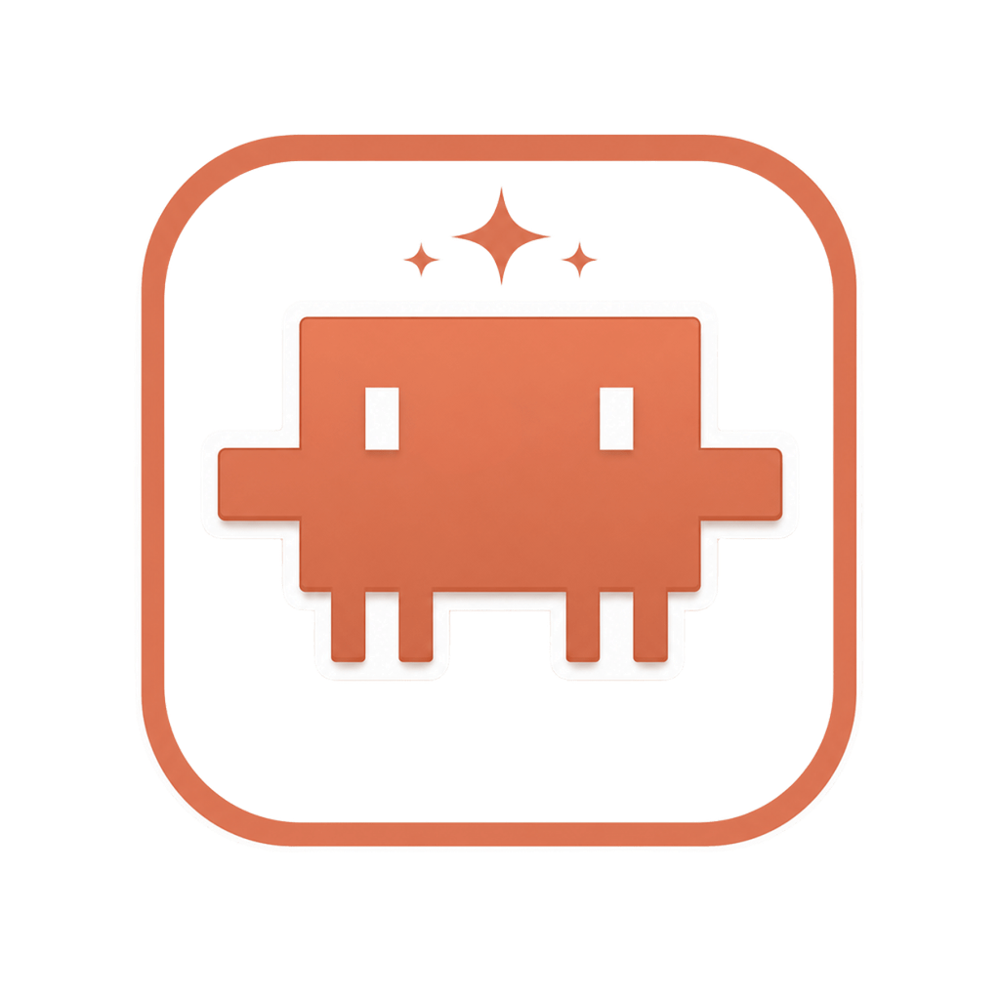

# 🐾 Clapet

**Clapet** — забавный desktop-питомец, который живёт прямо на вашем рабочем столе. Ходит по экрану, реагирует на клики, общается через ИИ и поднимает настроение. Собран на Electron.

<p align="center">
  
</p>

[](README.md)

---

## ✨ Возможности

- 🖥️ **Живой питомец** — бегает по экрану, моргает, реагирует на перетаскивание
- 🎯 **Радиальное меню** — правый клик открывает круглое меню с действиями
- 🤖 **ИИ-чат** — кнопка Ask для общения с нейросетью
- 🚶 **Авто-ходьба** — питомец сам гуляет по экрану (вкл/выкл)
- 😴 **Режимы** — Think, Happy, Sleep, Feed — каждый со своей анимацией
- ⚙️ **Настройки** — выбор провайдера ИИ, API-ключ, модель, прокси
- 🎨 **Fluent-иконки** — все иконки в стиле Microsoft Fluent UI (SVG)
- 🟠 **Gruvbox dark тема** — тёплый тёмно-оранжевый дизайн (#b54a30)
- 🔒 **Скрытый Electron** — никаких следов Electron в userAgent, никаких F12/DevTools
- 📦 **Кроссплатформенность** — Windows, Linux, macOS

---

## 🚀 Быстрый старт

```bash
npm install
npm start
```

---

## 💻 Поддерживаемые платформы

| Платформа | Статус | Формат |
|----------|--------|--------|
| Windows x64 | ✅ Полная поддержка | `.exe` (NSIS установщик) |
| Windows ARM64 | ✅ Полная поддержка | `.exe` (NSIS установщик) |
| Linux x64 | ✅ Полная поддержка | `.AppImage`, `.deb` |
| macOS x64 | ✅ Полная поддержка | `.dmg` |
| macOS ARM64 | ✅ Полная поддержка | `.dmg` |

---

## 🏗️ Сборка

### Локальная

```bash
npm run build
```

Готовый установщик — в папке `dist/`.

### CI/CD (GitHub Actions)

Создайте тег и пушните:

```bash
git tag v0.2.0
git push --tags
```

GitHub Actions автоматически соберёт все версии. Скачать — **Actions** → последний запуск → **Artifacts**.

---

## 🤖 ИИ-провайдеры

- **OpenAI** — GPT-4, GPT-4o, o1, o3
- **Anthropic** — Claude 3.5 Sonnet, Claude 3 Opus
- **Google Gemini** — Gemini 1.5 Pro, Gemini 2.0 Flash
- **Groq** — Llama 3, Mixtral (быстрый инференс)
- **DeepSeek** — DeepSeek V2, DeepSeek Coder
- **Mistral** — Mistral Large, Mistral Small
- **OpenRouter** — единый доступ к 200+ моделям
- **Together AI** — хостинг open-source моделей
- **Perplexity** — Sonar, Sonar Pro
- **xAI (Grok)** — Grok-2, Grok-mini
- **GitHub Models** — бесплатный доступ через GitHub токен
- **Custom** — любой OpenAI-совместимый API (например, локальная LLM)

Встроена поддержка прокси (HTTP/HTTPS/SOCKS).

---

## 🎮 Использование

### Режим питомца

Маленькое окно 187×204 пикселей. Управление:

| Действие | Ввод |
|----------|------|
| **Перетаскивание** | Зажать и тащить питомца |
| **Радиальное меню** | Правый клик по питомцу |
| **Настройки** | Двойной клик |
| **Покормить** | 🍪 в радиальном меню (+10 XP, кулдаун 5 мин) |
| **Ходьба** | 🚶 вкл/выкл — питомец гуляет сам |
| **Спросить** | 💬 ввести вопрос, питомец ответит через ИИ |
| **Спать** | 😴 питомец засыпает с парящими буквами "Z" |

### Лаунчер

Главное окно 876×574 с четырьмя вкладками:

1. **Launch** — вход в режим питомца, превью сплэш-экрана
2. **Pet settings** — always-on-top, авто-ходьба, размер шрифта, частицы
3. **AI** — провайдер, модель, API-ключ, кастомный эндпоинт
4. **Main settings** — цвет акцента, прокси, TTS, о программе

---

## 🎯 Система уровней

- Каждая кормёжка даёт **+10 XP**
- Формула уровня: `XP_required(n) = 15 * n * (n + 1)`
  - Уровень 1: 30 XP, Уровень 2: 90 XP всего, Уровень 3: 180 XP всего...
- XP-бар появляется при кормёжке с плавной анимацией заполнения
- "+10" всплывает и исчезает
- При повышении уровня — взрыв сердечек

---

## 🛠️ Технологии

| Компонент | Что используется |
|-----------|-----------------|
| **Фреймворк** | Electron 33 |
| **Язык** | Vanilla JavaScript (без React/Vue) |
| **Стили** | CSS (кастомные, без библиотек) |
| **Сохранение** | LocalStorage |
| **Клавиши** | `keyspy` — глобальный перехват нажатий |
| **Сборка** | electron-builder 26 |
| **CI/CD** | GitHub Actions |
| **Платформы** | Windows x64/ARM64, Linux x64, macOS x64/ARM64 |

---

## 📁 Структура проекта

```
clapet/
├── .github/
│   └── workflows/
│       └── build.yml         # CI/CD pipeline
├── build/
│   └── icon.png              # Иконка приложения
├── src/
│   ├── index.html             # Главная страница (UI)
│   ├── main.js                # Логика питомца (рендерер)
│   └── styles.css             # Стили
├── dist/                      # Готовая сборка
├── main.js                    # Electron main process
├── package.json               # Конфиг и зависимости
├── run.bat                    # Запуск одним кликом (Windows)
└── run-nogpu.bat              # Запуск без GPU (Windows)
```

---

## ⚙️ Настройки

Все настройки хранятся в `localStorage`. Основные ключи:

| Ключ | Тип | По умолчанию | Описание |
|------|-----|-------------|----------|
| `pet_provider` | string | `openai` | Активный провайдер ИИ |
| `pet_model` | string | — | Выбранная модель |
| `pet_key` | string | — | API-ключ |
| `pet_wander` | int | `0` | Авто-ходьба |
| `pet_ontop` | int | `0` | Поверх всех окон |
| `pet_color` | string | `#b54a30` | Цвет акцента |
| `pet_xp` | int | `0` | Опыт |
| `pet_level` | int | `1` | Уровень |
| `particles_enabled` | int | `1` | Частицы |
| `proxy_enabled` | int | `0` | Прокси |
| `auto_think` | int | `1` | Случайные мысли |
| `tts_enabled` | int | `0` | Озвучка текста |

---

## 📋 Планы

- [x] Кроссплатформенная сборка (Win/Linux/Mac)
- [x] Интеграция ИИ-провайдеров
- [x] Система опыта и уровней
- [x] Свои цвета акцента
- [ ] Больше анимаций и состояний
- [ ] Скины и темы оформления
- [ ] Drag & drop файлов на питомца
- [ ] Звуковые эффекты
- [ ] Виджет-режим (погода, часы)

---

## 📜 Лицензия

MIT — делайте что хотите.

---

## 👤 Автор

**S1sTeam**

---

## ⚠️ Заметки

- При пересборке закройте Clapet.exe — иначе `EBUSY`. `taskkill /f /im Clapet.exe` на Windows.
- macOS сборки не подписаны — Gatekeeper будет ругаться. `xattr -dr com.apple.quarantine /Applications/Clapet.app` чтобы убрать блокировку.
- Linux сборки — `.AppImage` (портативный) и `.deb` (Debian/Ubuntu). Для других дистрибутивов соберите через `--linux tar.gz`.
